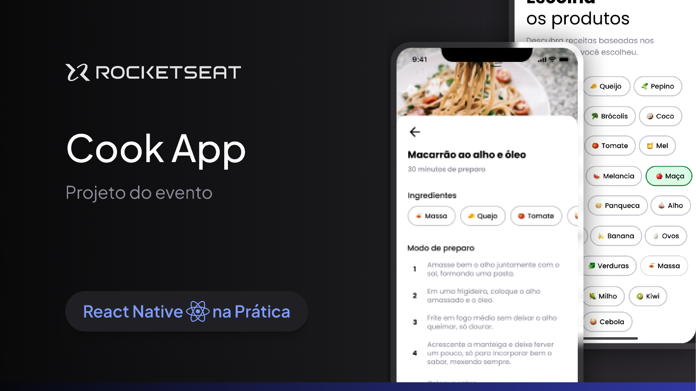
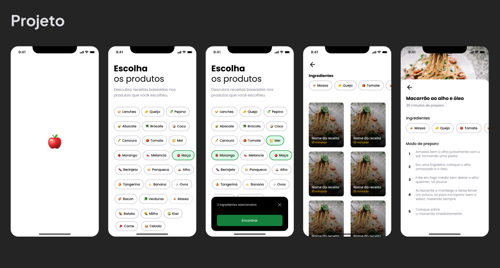

# 🥞 Cook App
<p align="center">
  <!-- Contador de linguagens do GitHub -->
  
  <!-- Tamanho do repositório no GitHub -->
  
  <!-- Licença do GitHub -->
  
</p>

<div align="center">
  
</div>

## 💻 Sobre o projeto
O CookApp foi criado como parte do curso de React Native da Rocketseat para demonstrar a construção de um aplicativo utilizando React Native, Expo e Supabase (BaaS). O objetivo é fornecer uma aplicação prática e funcional, integrando tecnologias modernas para uma experiência de usuário completa.

## ⚙️ Funcionalidades
- [x] Configuração inicial com Expo.
- [x] Integração com Supabase para gerenciamento de dados.
- [x] Utilização de TypeScript para um código mais robusto.
- [x] Suporte para dispositivos Android e iOS.

## 📱 Demo
<div align="center">
  
</div>

## ⚠️ Pré-requisitos
Antes de começar, instale e configure as seguintes ferramentas:
- **[Git](https://git-scm.com)**: Para clonar o repositório e gerenciar o código.
- **[Node.js](https://nodejs.org/en/)**: Para gerenciar dependências e executar scripts.
- **[Android Studio](https://developer.android.com/studio)**: Para configurar um emulador Android, se necessário.
- **Expo Go**: Para testar o aplicativo em dispositivos físicos Android. Instale na Google Play Store.
- **Editor de Código (opcional)**: [VSCode](https://code.visualstudio.com/) é recomendado para editar o código.

## 🧭 Rodando a aplicação
```bash
# Clone este repositório
$ git clone https://github.com/devAndreotti/cook-app.git

# Navegue para o diretório do projeto

# Instale as dependências
$ npm install

# Inicie a aplicação
$ npx expo start

# Para executar no emulador Android
$ a

# Para executar no dispositivo físico
# Abra o Expo Go e escaneie o QR Code exibido
```

## 🛠 Tecnologias
As seguintes tecnologias foram utilizadas na construção do projeto:
- **[React Navigation](https://reactnavigation.org/)**
- **[React Native](https://reactnative.dev/)**
- **[TypeScript](https://www.typescriptlang.org/)**
- **[Supabase](https://supabase.com/)**
- **[Expo](https://expo.dev/)**
> Veja o arquivo [package.json](https://github.com/SEU_USUARIO/CookApp/blob/main/package.json) para mais sobre as dependências do projeto.

## 💪 Contribuição
1. Faça um fork do projeto.
2. Crie uma nova branch para sua feature: `git checkout -b feature/nome-feature`.
3. Commit suas mudanças: `git commit -m 'Adiciona nova feature'`.
4. Envie para a branch: `git push origin feature/nome-feature`.
5. Abra um Pull Request.

## 📝 Licença
Este projeto está licenciado sob a licença [MIT](./LICENSE).
